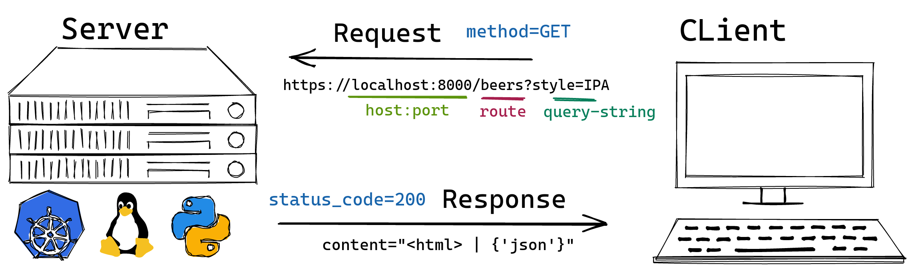

# Python para web

Vamos adicionar uma API em nosso projeto :)

## Ambiente

O setup continua o mesmo, lembre-se de executar `poetry shell` e `poetry install` para garantir que tudo está atualizado.

> **NOTA** caso não funcione `poetry shell` no gitpod, execute `pip install poetry` antes.

## Introdução a web

A web é baseada primariamente no protocolo HTTP que por especificação serve para transferir
texto de um servidor para um cliente.

O texto que trafega do servidor para o cliente é chamado de Hiper Texto, ou seja, texto onde
além de palavras e letras, contém também marcações semanticas e links para outros textos.

bom... esse foi o design original, hoje em dia usamos esse texto para trafegar todo tipo de 
conteúdo.

Principalmente HTML (junto com CSS e JS) e/ou JSON, além de streams de texto que reprensentam
arquivos binários como imagens, videos e audios.

As palavras **chave** que você vai utilizar ao trabalhar com web são:


- Servidor
- Cliente
- URL, rota e query string
- Métodos HTTP
- Request
- Response
- Payload




## Introdução ao FastAPI


O FastAPI é um framework Python que implementa o protocolo `ASGI`
(Async Gateway Interface) além de ser super rápido por ser assincrono ele utiliza as type annotations do Python 3 para garantir a definição de rotas e parâmetros.

Vamos criar uma api responsável por retornar em texto em formato `JSON` e faremos isso no arquivo `beerlog/api.py`

> **NOTA** em uma aplicação maior a boa prática seria criar um módulo separado para api como `beerlog/api/rotas.py, etc...` mas para manter a simplicidade vamos manter em um único arquivo.

```py
from fastapi import FastAPI


api = FastAPI(title="beerlog")
```

Para executar precisamos de um servidor ASGI e para isso usaremos o `uvicorn`

```bash
poetry add uvicorn
```

Agora podemos executar a api com 

```bash
uvicorn beerlog.api:api --reload
```

Ao acessar https://localhost:8000/docs veremos a página de docs da api, e também temos a página /redoc

Para adicionar recursos a API precisar criar `rotas`

Como o `Typer` (ferramenta que usamos para fazer o CLI) e o
`FastAPI` seguem o mesmo padrão, podemos copiar parte da função `list_beers` e registrar como rota.


```py
from typing import Optional
from fastapi import FastAPI
from beerlog.core import get_beers_from_database

api = FastAPI(title="beerlog")


@api.get("/beers/")
def list_beers(style: Optional[str] = None):
    """Lists beers from the database"""
    beers = get_beers_from_database(style)
    return beers
```

Agora ao acessar veremos a rota `/beers/` e podemos interagir através do browser ou pelo terminal com `curl http://localhost:8000/beers/` ou `curl http://localhost:8000/beers/?style=IPA`


## Serializando dados

Para seguir melhor o padrão `OAS3` precisamos informar corretamente a especificação dos objetos da nossa API.

> **NOTA**  veja na página `/docs` que `Schema` está em branco.

Para definir os schemas precisamos definir os serializadores 
de entrada e de saida.

em teoria poderiamos usar o prório model `Beer` mas isso não é
uma boa prática pelo fato de beer expor campos e funcionalidade do banco de dados.

No arquivo `beerlog/serializers.py` criaremos 2 classes, que irão se parecer bastante com o nosso model `Beer`.


```py
from datetime import datetime
from pydantic import BaseModel, validator
from fastapi import HTTPException, status


class BeerOut(BaseModel):
    id: int
    name: str
    style: str
    flavor: int
    image: int
    cost: int
    rate: int
    date: datetime


class BeerIn(BaseModel):
    name: str
    style: str
    flavor: int
    image: int
    cost: int

    @validator("image", "flavor", "cost")
    def validate_ratings(cls, v, field):
        if v < 1 or v > 10:
            raise HTTPException(
                detail=f"{field.name} must be between 1 and 10", 
                status_code=status.HTTP_400_BAD_REQUEST
            )
        return v
```

Agora voltamos ao `api.py` para utilizar os serializers.


```py
from typing import Optional, List
from fastapi import FastAPI, Response, status
from beerlog.core import get_beers_from_database
from beerlog.serializers import BeerIn, BeerOut
from beerlog.models import Beer
from beerlog.database import get_session


api = FastAPI(title="beerlog")


@api.get("/beers", response_model=List[BeerOut])
async def list_beers(style: Optional[str] = None):
    """Lists beers from the database"""
    beers = get_beers_from_database(style)
    return beers


@api.post("/beers", response_model=BeerOut)
async def add_beer(beer_in: BeerIn, response: Response):
    beer = Beer(**beer_in.dict())
    with get_session() as session:
        session.add(beer)
        session.commit()
        session.refresh(beer)

    response.status_code = status.HTTP_201_CREATED
    return beer
```

## Rodando em um container

Criando o Dockerfile em `docker/Dockerfile`


```dockerfile
ARG APP_NAME=beerlog
ARG APP_PATH=/opt/$APP_NAME
ARG PYTHON_VERSION=3.8.13
ARG POETRY_VERSION=1.1.13

# Stage: staging
FROM python:$PYTHON_VERSION as staging
ARG APP_NAME
ARG APP_PATH
ARG POETRY_VERSION

ENV \
    PYTHONDONTWRITEBYTECODE=1 \
    PYTHONUNBUFFERED=1 \
    PYTHONFAULTHANDLER=1
ENV \
    POETRY_VERSION=$POETRY_VERSION \
    POETRY_HOME="/opt/poetry" \
    POETRY_VIRTUALENVS_IN_PROJECT=true \
    POETRY_NO_INTERACTION=1

# Install Poetry - respects $POETRY_VERSION & $POETRY_HOME
RUN curl -sSL https://raw.githubusercontent.com/python-poetry/poetry/master/install-poetry.py | python
ENV PATH="$POETRY_HOME/bin:$PATH"

# Import our project files
WORKDIR $APP_PATH
COPY ./poetry.lock ./pyproject.toml ./
COPY ./$APP_NAME ./$APP_NAME

# Stage: development
FROM staging as development
ARG APP_NAME
ARG APP_PATH
WORKDIR $APP_PATH
RUN poetry install
ENTRYPOINT ["poetry", "run"]
CMD ["uvicorn", "beerlog.api:api", "--host=0.0.0.0","--port=8000","--reload"]

# Stage: build
FROM staging as build
ARG APP_PATH

WORKDIR $APP_PATH
RUN poetry build --format wheel
RUN poetry export --format requirements.txt --output constraints.txt --without-hashes

# Stage: production
FROM python:$PYTHON_VERSION as production
ARG APP_NAME
ARG APP_PATH

ENV \
    PYTHONDONTWRITEBYTECODE=1 \
    PYTHONUNBUFFERED=1 \
    PYTHONFAULTHANDLER=1

ENV \
    PIP_NO_CACHE_DIR=off \
    PIP_DISABLE_PIP_VERSION_CHECK=on \
    PIP_DEFAULT_TIMEOUT=100
ENV \
    PORT=8000

# Get build artifact wheel and install it respecting dependency versions
WORKDIR $APP_PATH
COPY --from=build $APP_PATH/dist/*.whl ./
COPY --from=build $APP_PATH/constraints.txt ./
RUN pip install ./$APP_NAME*.whl --constraint constraints.txt

COPY ./docker/entrypoint.sh /entrypoint.sh
RUN chmod +x /entrypoint.sh
ENTRYPOINT ["/entrypoint.sh"]
CMD ["uvicorn", "beerlog.api:api", "--host=0.0.0.0","--port=$PORT"]
```

e um `docker/entrypoint.sh`


```sh
#!/bin/sh

set -e

# You can put other setup logic here
# Evaluating passed command:
eval "exec $@"
```

Para fazer o build.

```bash
docker build -t beerlog/prod --file docker/Dockerfile .
```

Para rodar

```bash
# e
docker run -p 8000:8000 beerlog/prod

# ou para alterar a porta
docker run -p 8000:5000 -e PORT=5000 beerlog/prod
```

Para a imagem de development

```bash
docker build --target development -t beerlog/dev --file docker/Dockerfile .
```

