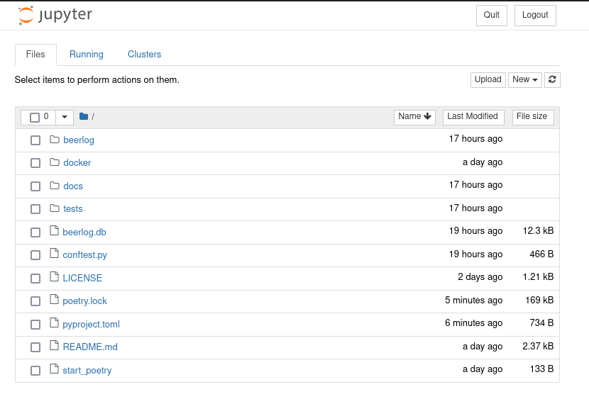
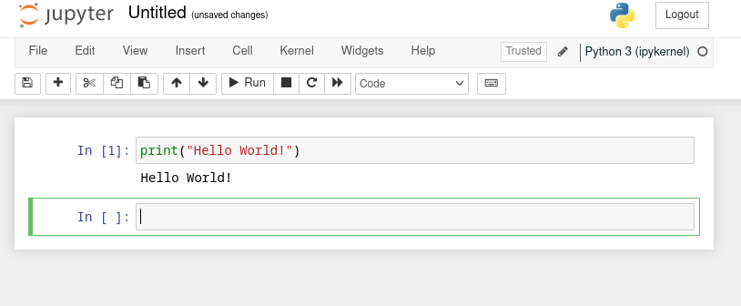
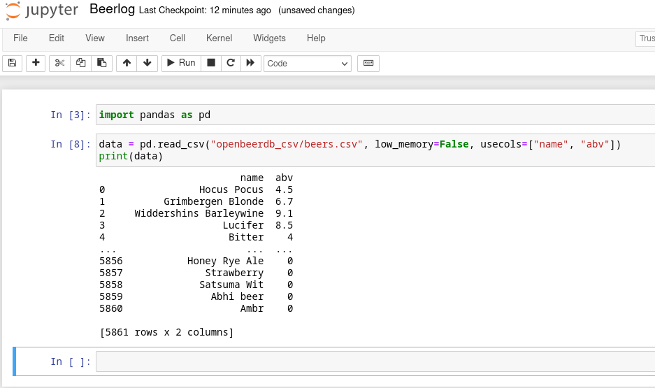
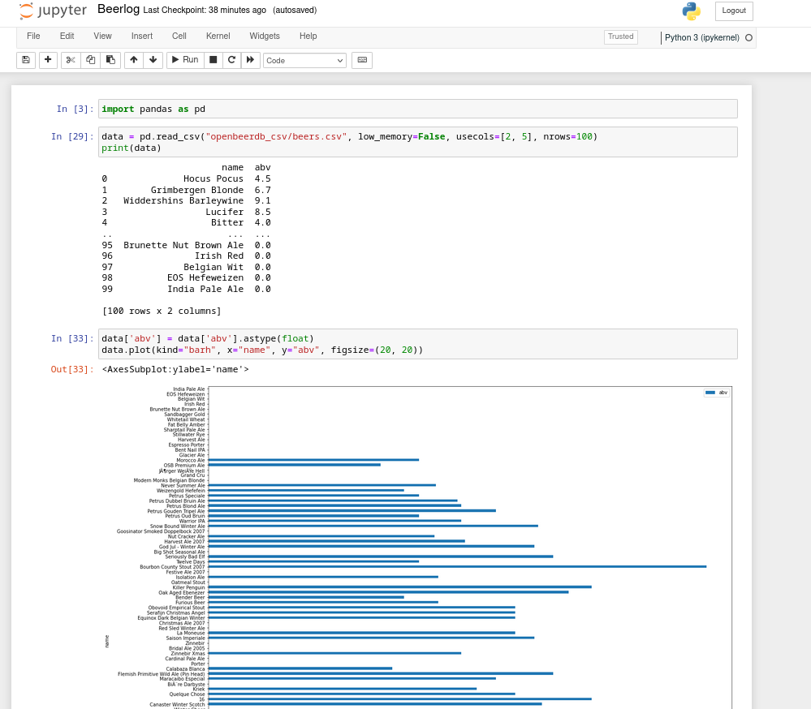
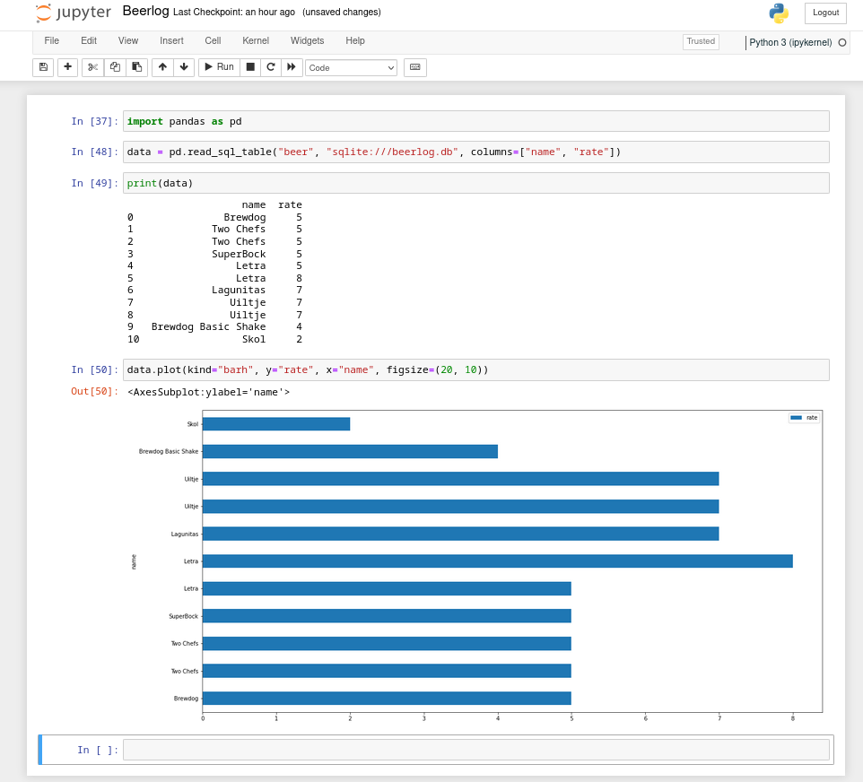
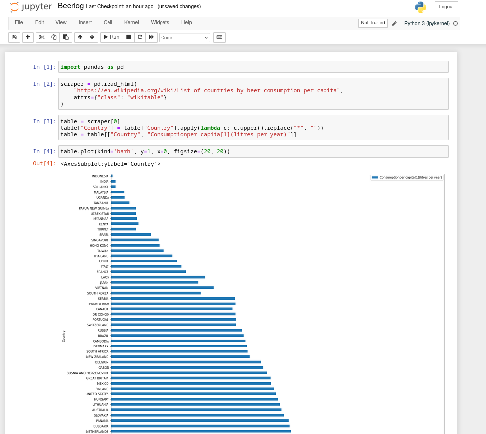

# Analise de dados com Python

Python é uma linguagem muito utilizada para análise de dados e se tornou de fato a principal linguagem
nas areas de Data Science, Jornalismo de dados, estatistica e BI.

Vamos conhecer algumas ferramentas do Python para análise de dados.

> **DISCLAIMER** Eu, Bruno, não sou um profissional da area de ciência de dados , portanto o conhecimento que passarei
> nesta parte será bastante limitado. Recomendo outros canais para quem deseja aprofundar no tema.

## Jupyter

Jupyter é um projeto que nasceu do `ipython` o terminal interativo e antigamente se chamava `ipython notebooks` porém
ganhou muitas melhorias e suporte a várias linguagens e adotou o nome `Jupyter`, a idéia do Jupyter era juntar
as 3 principais linguagens usadas em data science (JUlia, PYThon E R).

Ele é uma ferramenta que roda com 2 serviços principais, um chamado de `jupyter kernel` que é onde o código é executado
e outro chamado `jupyter notebook` que funciona como front-end para esse kernel.

O código é escrito no front usando o browser e executado no lado servidor no kernel.

No gitpod o Jupyter já vem instalado mas é interessante instalar alguma dependencias

```bash
poetry add jupyter matplotlib lxml bs4 requests html5lib
```

## Como utilizar o Jupyter?

Primeiro definimos o password do nosso server

```bash
jupyter notebook password
```

agora ao executar com

```
jupyter notebook
```
Ou no gitpod usando

```
jupyter notebook --NotebookApp.allow_origin=\'$(gp url 8888)\'
```

no terminal obtemos uma instância do servidor rodando em uma porta `8888`

Essa é a interface inicial do Jupyter




Agora podemos criar um novo notebook clicando em `new`


O Jupyter funciona com o sistema de células
onde cada bloco de código é separado e pode ser executado individualmente.




> Opcionalmente também podemos usar o https://colab.research.google.com/ que é um serviço do google para usar o Jupyter online.

## ETL

Extract Transform Load

É o processe de **extrair** informações das mais variadas fontes como arquivos, bancos de dados, páginas web.

**Transformar** tratando e organizando em um formato fácil de manusear.

e finalmente **Carregar** esses dados em modelos de machine learning, bancos de dados etc...

## Pandas

Pandas é uma biblioteca que inclui uma variedade imensa de módulos úteis para analisar dados com Python e entre outras coisas o Pandas consegue

- Extrair dados de diversas fontes
- Transformar dados usando Series e Dataframes
- Plotar os dados em gráficos
- Realizar operações computacionais em cima dos dados.

Exemplos:


### Lendo um `.csv` com pandas.

Vamos usar o https://openbeerdb.com/ que fornece um arquivo .csv com milhares de dados sobre cervejas este é o link para baixar o arquivo.

https://openbeerdb.com/files/openbeerdb_csv.zip

No terminal

```bash
wget https://openbeerdb.com/files/openbeerdb_csv.zip
unzip openbeerdb_csv.zip
```

Agora temos uma pasta `openbeerdb_csv` com alguns dados para analisar.




Repare que temos 5861 registros para analisar.

O que fazer com essa informação?





## Analisando os dados do Beerlog





## Analisando dados da web





> **DICA** O jupyter também funciona integrado ao Vscode `code Beerlog.ipynb` 